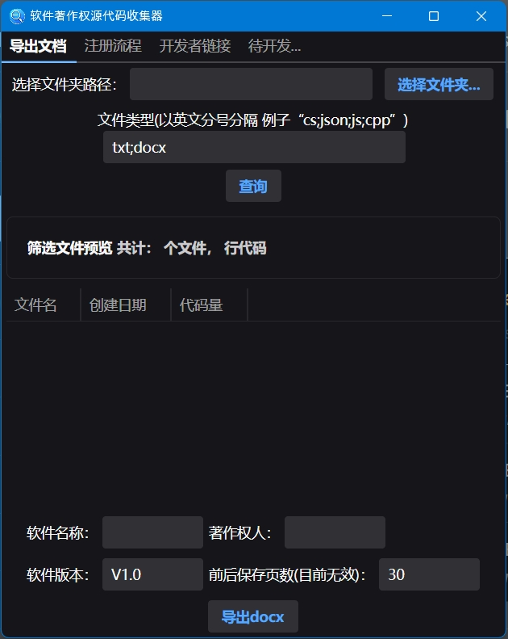

# 软件著作权源代码收集器 

## 项目简介

这是一个基于 Avalonia UI 框架开发的跨平台桌面应用程序，用于帮助开发者快速收集和整理软件著作权申请所需的源代码文档。

## 软件界面预览

## 技术框架

- **.NET 8.0**: 基础开发框架
- **Avalonia UI 11.2.3**: 跨平台 UI 框架
- **CommunityToolkit.Mvvm**: MVVM 架构支持
- **DocumentFormat.OpenXml**: Word 文档处理
- **Semi.Avalonia**: UI 主题组件库

## 主要功能

1. **源代码收集**

   - 支持选择指定文件夹路径
   - 可自定义文件类型筛选（如：cs;json;js;cpp 等）
   - 支持文件预览功能

2. **文档导出**
   - 支持导出为 Word 格式（docx）
   - 可配置软件基本信息：
     - 软件名称
     - 著作权人
     - 软件版本

## 界面布局

- 采用 Tab 页设计，包含：
  - 导出文档
  - 注册流程
  - 开发者链接
  - 待开发功能预留

## 使用方法

1. 选择要收集的源代码所在文件夹
2. 输入需要筛选的文件类型
3. 点击查询按钮预览文件
4. 填写软件相关信息
5. 点击"导出 docx"生成文档

## 注意事项

- 文件类型过滤时需使用英文分号分隔
- 导出前请确保填写完整的软件信息

## 使用演示

