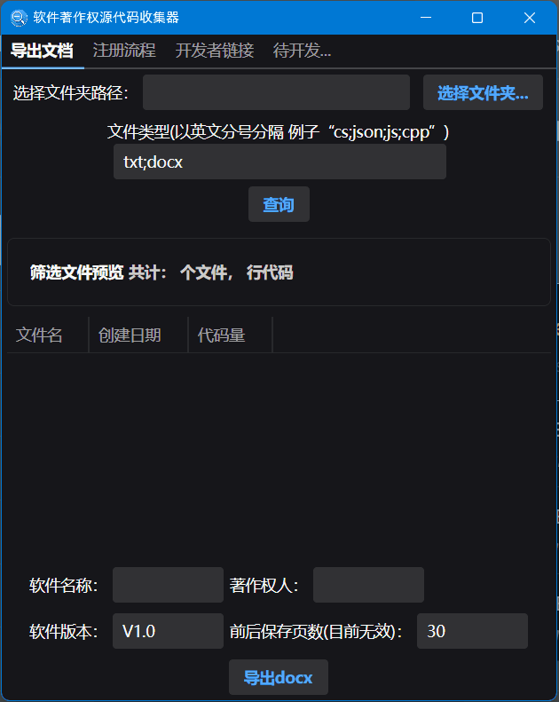

# 软件著作权源代码收集器 [](https://github.com/jindongjie/SoftwareCopyrightSourceCodeCollector/actions/workflows/dotnet-desktop.yml) [](https://sonarcloud.io/summary/new_code?id=jindongjie_SoftwareCopyrightSourceCodeCollector) [](https://sonarcloud.io/summary/new_code?id=jindongjie_SoftwareCopyrightSourceCodeCollector)

## 项目简介

这是一个基于 Avalonia UI 框架开发的跨平台桌面应用程序，无需依赖、完全开源，用于帮助开发者快速收集和整理软件著作权申请所需的源代码文档，适用操作系统(Windows/Linux/MacOS)。

注明：本软件在作者 Windows11 系统，Linux系统（wayland图形后端）上测试过，MacOS尚未测试，若能运行，麻烦说一声
## 软件界面预览


## 安装方法
1. **通过 github release**
   1.1 点击右侧边栏的资源
   1.2 下载栏找到最新一次的发布资源
   1.3 根据操作系统自行下载对应的软件
   1.4 直接运行即可
   - 目前支持x86-64架构的自动编译，其他架构请自行编译
2. **手动编译**
   2.1 克隆该项目到本地
   2.2 使用 ``` dotnet publish SoftwareCopyrightSourceCodeCollector.Desktop/SoftwareCopyrightSourceCodeCollector.Desktop.csproj -c Release --self-contained true /p:PublishSingleFile=true /p:PublishReadyToRun=true /p:PublishTrimmed=false --runtime ```(自己的架构例如(win-x64/linux-x64/osx-x64）
   
## 主要功能

1. **源代码收集**

   - 支持选择指定文件夹路径
   - 可自定义文件类型筛选（如：cs;json;js;cpp 等）
   - 支持文件预览功能
   - 设置程序入口程序

2. **文档导出**
   - 支持导出为 Word 格式（docx）
   - 可配置软件基本信息：
     - 软件名称
     - 著作权人
     - 软件版本

## 界面布局

- 采用 Tab 页设计，包含：
  - 导出文档
  - 注册流程
  - 开发者链接

## 使用方法

1. 选择要收集的源代码所在文件夹
2. 输入需要筛选的文件类型
3. 点击查询按钮预览文件
4. 找到程序入口源码文件
5. 填写软件相关信息
6. 点击"导出 docx"生成文档

## 注意事项

- 文件类型过滤时需使用英文分号分隔
- 软著申请程序源码量最好大于3000行，少于3000行需特别说明！
## 使用演示



## 技术框架

- **.NET 8.0**: 基础开发框架
- **Avalonia UI 11.2.3**: 跨平台 UI 框架
- **CommunityToolkit.Mvvm**: MVVM 架构支持
- **DocumentFormat.OpenXml**: Word 文档处理
- **Semi.Avalonia**: UI 主题组件库
